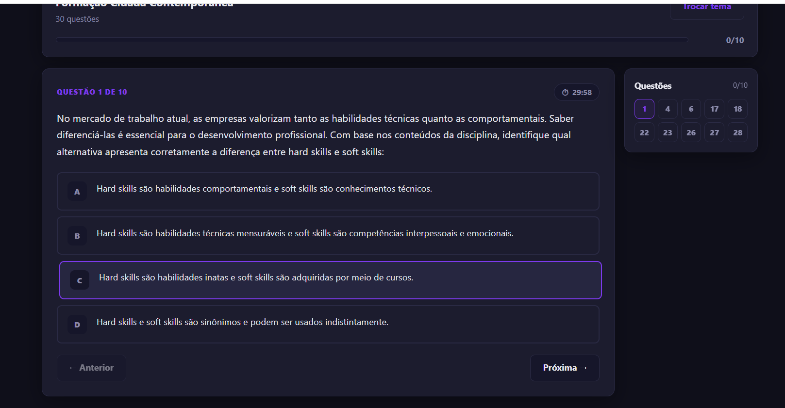

# MXOS — Simulador de Questões

> Plataforma web de simulados com **gabarito protegido no servidor**, 10 questões aleatórias por sessão, histórico pessoal e ranking competitivo. Desenvolvido para alunos da UNINTER.

🌐 **Demo ao vivo:** [simulado.mxos.com.br](https://simulado.mxos.com.br)

---

## 📸 Screenshots

### Tela inicial


### Seleção de simulados


### Quiz em andamento


---

## ✨ Funcionalidades

- 🔐 **Login por RU** — sem necessidade de senha
- 🎲 **10 questões aleatórias** por sessão — sorteadas das 30 disponíveis por tema
- ✅ **Correção automática** com feedback imediato e explicação
- 📖 **Revisão comentada** ao final com fonte bibliográfica
- 📊 **Histórico pessoal** — todos os simulados finalizados
- 🏆 **Ranking** — top 10 alunos por tema
- 🌙 **Tema Dark / Light** alternável
- 📱 **Design responsivo** — funciona em celular, tablet e desktop
- 🔒 **Gabarito protegido** — nunca exposto no frontend (F12 não revela)

---

## 📚 Simulados Disponíveis (8 temas — 240 questões)

| # | Tema | Questões no banco |
|---|------|------------------|
| 1 | Certificações em Segurança Cibernética | 30 |
| 2 | Formação Cidadã Contemporânea | 30 |
| 3 | Formação Inicial em Educação a Distância | 30 |
| 4 | Segurança de Redes e Comunicações | 30 |
| 5 | Português Elementar | 30 |
| 6 | Sistemas de Segurança na Informação | 30 |
| 7 | Sistemas de Informações Gerenciais | 30 |
| 8 | Tecnologias Digitais para Segurança Cibernética | 30 |

---

## 🛠️ Stack Técnica

| Camada | Tecnologia |
|--------|-----------|
| Backend | Node.js + Express |
| Banco de dados | SQLite (sql.js) |
| Frontend | HTML5 + CSS3 + JavaScript puro (SPA) |
| Servidor | Contabo VPS (Ubuntu) |
| Proxy reverso | Nginx |
| Processo | PM2 |
| CI/CD | GitHub Actions |

---

## 📁 Estrutura do Projeto

```text
uninter-mxos-simulador/
├── backend/
│   ├── server.js           # Servidor Express (porta 4000)
│   ├── database.js         # Conexão SQLite + índices de performance
│   ├── config.js           # Configurações centralizadas
│   ├── seed.js             # Popula o banco com 240 questões
│   ├── middleware/
│   │   └── auth.js         # Autenticação JWT
│   └── routes/
│       ├── auth.js         # POST /api/auth/login
│       ├── temas.js        # GET /api/simulado/temas
│       ├── questoes.js     # GET /api/simulado/temas/:id/questoes
│       ├── responder.js    # POST /api/simulado/responder e /finalizar
│       ├── historico.js    # GET /api/simulado/historico
│       └── ranking.js      # GET /api/simulado/ranking/:topicId
├── frontend/
│   └── index.html          # SPA completa (CSS e JS embutidos)
├── docs/
│   └── screenshots/        # Screenshots do projeto
├── .github/
│   └── workflows/
│       └── deploy.yml      # CI/CD automático
├── CONTEXT.md              # Contexto para agentes de IA
└── README.md
```

---

## 🔌 API Endpoints

| Método | Endpoint | Descrição |
|--------|----------|-----------|
| `POST` | `/api/auth/login` | Login por RU |
| `GET` | `/api/simulado/temas` | Lista todos os simulados |
| `GET` | `/api/simulado/temas/:id/questoes` | Retorna 10 questões aleatórias sem gabarito |
| `POST` | `/api/simulado/responder` | Valida resposta — retorna isCorrect, explanation, source |
| `POST` | `/api/simulado/finalizar` | Finaliza simulado — retorna resultado completo |
| `GET` | `/api/simulado/historico` | Histórico de simulados do aluno logado |
| `GET` | `/api/simulado/ranking/:topicId` | Top 10 alunos por tema |

---

## 🔐 Segurança

- Gabarito armazenado exclusivamente no banco SQLite do servidor
- Endpoint de questões retorna apenas enunciado e alternativas — nunca a resposta correta
- Validação 100% no servidor — inspecionar o código-fonte não revela respostas
- sessionQuestionIds validados no servidor — impossível manipular quais questões foram sorteadas
- CORS restrito ao domínio de produção
- Payload limitado a 100kb
- JWT para autenticação de todas as rotas protegidas

---

## 🚀 Como Rodar Localmente

### Pré-requisitos
- Node.js v18 ou superior

### Instalação

```bash
git clone https://github.com/maxwellnasci/uninter-mxos-simulador.git
cd uninter-mxos-simulador
cd backend
npm install
node seed.js
node server.js
```

Acesse: http://localhost:4000

---

## ⚙️ CI/CD

Push na branch `main` dispara automaticamente:

1. Verificação dos arquivos essenciais
2. Conexão no servidor via SSH
3. git pull origin main
4. npm install --production
5. pm2 reload mxos (zero downtime)

---

## 🧑💻 Autor

Desenvolvido por **Maxwell Nasci**

- GitHub: [@maxwellnasci](https://github.com/maxwellnasci)
- Deploy: [simulado.mxos.com.br](https://simulado.mxos.com.br)

---

## 📄 Licença

MIT
